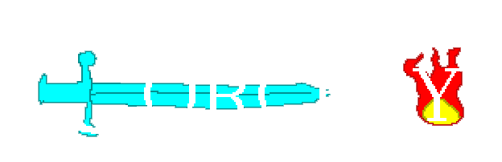
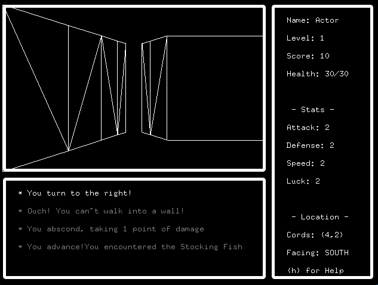
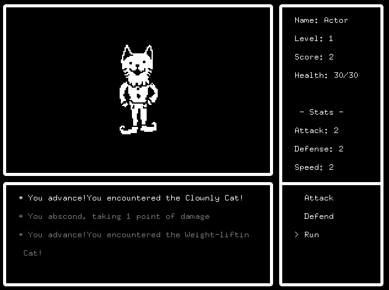
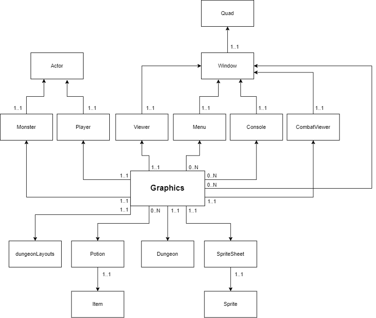

Created by Connor Milligan and Tim Harrold as a final project for CS120 - Advanced Programming

## Overview

This is a (pseudo) 3-d maze game, where users can input a custom map to
find your way through! With a working console and info panel,
the user can see their coordinates in the maze, and the direction they are facing.

Dungeons are given via a custom file containing a 2-d array. On the bounds of the array, there should be a wall of `1`'s
that keep from bounding errors in the program. Inside, a collection of `1`'s and `0`'s that represent walls, and pathways.
For example, a wallway may be represented as:

`101`

`101`

`101`

The player will first be greeted by a splash screen with the title of the game. Pressing `s` takes the user to the main game, and switches to and ending screen once the end of the maze is reached.

## Playing the game
No additional dependencies beyond FreeGLUT are needed to play the game. To run the program, a user may either use CLion, or the provided makefile.

Compiling via makefile can be accomplished via `make graphics`. The program is run with `./graphics`.

## Controls

The game can be controlled via:

`Enter`: Start Game

`h`: Display Help Menu

`m`: Display minimap

`i`: Display Inventory

`p`: Display Player Stats

`Escape`: Exit Menu/Exit Game

`Up Arrow`: Move Forward

`Down Arrow`: Move Back

`Right Arrow`: Turn Right

`Left Arrow`: Turn Left

### Debugging Commands
These commands are used to test certain functionality of the game. It is expected that
a player will not use these during regular gameplay!

`k`: Add XP

`j`: Initiate Combat

`a`: Add healing potion to inventory

## ER Diagram

## Objects used

This game features a number of custom objects to assist in rendering, listed below. Our design follows the `MVC` - `Model, VIew Controller` pattern.

### `Graphics.cpp`: Main program used to initialize the graphical program and run all logic

#### `Item`: Players can receive a number of objects in the game

### `Potion`: A type of item consumed by a player. Some examples of potions are included below:
`HEALING`: Heals the player for 15 health

`TELEPORTATION`: Teleports the player to a random coordinate on the map

`STRENGTH`: Adds 1 to the player's attack stat

`DEFENSE`: Adds 1 to the player's defense stat

#### `dungeonLayouts`: Input file for dungeon layouts. Dungeons are designed as a 2-d array of walls, with a series of `0` and `1` characters that will be interpreted as booleans. These represent walls and halls. Visited tiles are also tracked for the minimap functionality. Additionally, an array of starting and ending coordinates for each maze is included

#### `Dungeon`: Our model holds information about your given dungeon. It will return tiles, as well as where the ending is. When instantiated, a programmer is expected to pass ending coordinates to this object.

### `Sprite`: Information about 2-d sprites that are optionally included in the game

`SpriteSheet`: A collection of sprites used for the game. This includes monsters and logos

### `Actor`: General Class for a character with stats

`Player`: Inherits from Actor. This controller holds methods for movement, as well as perspective of the player. Where they're facing and moving is held here, and there are methods to move and turn.

`Monster`: Inherits from Actor. This is an actor with individual stats, health, and a sprite/name for display purposes.

### `Quad`: Rectangle used to display content

#### `Window`: Abstract object used to display graphical data to a user

`Menu`: This controls user selection during various stages of the game - an example of this is combat options such as 'run', or 'attack'. A menu is also implemented in the player's inventory to use or drop items.

`Viewer`: This view holds spatial data about what is displayed to the user. On turn, move, or perspective change, this calculates and draws lines to display the dungeon to a user.

`Console`: Abstract object used to display text data to a user, such as movement and combat information

`CombatViewer`: This is an optional view conditionally rendered over the main console if the player is initiated in combat. It contains a sprite, and will allow the player to choose courses of action in combat.

## Sprites
The sprite implementation uses a bit of a strange, but unique, method. Sprites are stored in C header files as a character pointer. The character pointer is decoded by a preprocessor definition, which takes a array and converts the character three integers corresponding to rgb values. Each sprite als has a width and height to determine when to return the carriage. As drawing each sprite functions similarly to writing text though instead of characters it simply draws a quad with the rbg value from the preprocessor function.
